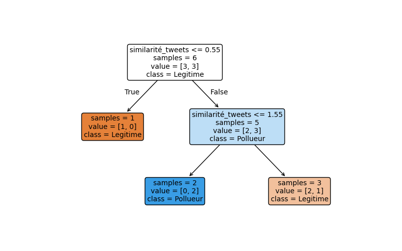

### Tâche 1 : Compréhension de l’algorithme GBoost

(1) Expliquez le principe de fonctionnement de l’algorithme de boosting de gradient (GBoost).  
(2) Soulignez ses forces et avantages comparatifs.

## GBoost : introduction

L'algorithme GBoost est une méthode d'apprentissage automatique utilisée pour améliorer la performance des modèles de prédiction, notamment les arbres de décision. Il appartient à la famille des algorithmes d’ensemble et repose sur l’idée d’entraîner plusieurs modèles de manière séquentielle afin de réduire progressivement l’erreur. Contrairement à une forêt aléatoire, qui entraîne des arbres en parallèle et agrège leurs résultats, GBoost ajuste chaque nouvel arbre en fonction des erreurs des arbres précédents pour corriger leurs prédictions.

Les arbres de décision seuls présentent plusieurs limitations. Ils sont très sensibles aux données d’apprentissage et peuvent soit sous-ajuster, en ne capturant pas suffisamment les tendances, soit sur-ajuster, en s’adaptant trop aux spécificités des données et en perdant leur capacité de généralisation. De plus, leur performance est fortement influencée par la structure des données et par la qualité de l’étiquetage. Dans un contexte où l’on dispose d’un volume suffisant de données bien structurées et où l’objectif est d’atteindre une haute précision, GBoost permet d’améliorer un arbre de décision en l’intégrant dans un processus itératif de correction des erreurs.

## Principe de fonctionnement

GBoost construit une série d’arbres de décision de manière séquentielle, où chaque nouvel arbre est entraîné pour minimiser l’erreur des prédictions accumulées. L’idée centrale est que chaque nouvel arbre vient **corriger les erreurs du modèle précédent** en se basant sur la direction qui permet de réduire la fonction de perte.

### Données

L'algorithme prend en entré des données X et a en sortie une prediction Y. Il existe deux types de prédiction (Y), soit une prediction de classe (nombre représentant un catégorie) ou un prédiction par regression (nombre continue représentant un quantité). L'algorithme GBoost s'implémente pour les deux type avec la librairie [`GradientBoostingClassifier`](https://scikit-learn.org/stable/modules/generated/sklearn.ensemble.GradientBoostingClassifier.html) ou [`GradientBoostingRegressor`](https://scikit-learn.org/stable/modules/generated/sklearn.ensemble.GradientBoostingRegressor.html).

Les données en entrée du modèle sont des charactéristiques (features) provenant d'un ensemble de données. Par exemple pour la classification d'utilisateurs polluant ou legitime ou pourrait avoir `nombre_de_tweets`, `similarité_tweets`, `fréquence_tweets`. La classe enb sortie dans ce cas correspond a un classification; `0` pour un utilisateur legitime et `1` pour un utilisteur polluant. Par exemple, supposon cette ensemble de données.

| **nombre_de_tweets** | **similarité_tweets** | **fréquence_tweets** | **classe** |
| -------------------- | --------------------- | -------------------- | ---------- |
| 1087                 | 3.10                  | 2                    | 1          |
| 1200                 | 0.1                   | 1.25                 | 0          |
| 1000                 | 1.6                   | 0.05                 | 0          |
| 890                  | 1.5                   | 0.9                  | 1          |
| 500                  | 2.5                   | 1.2                  | 0          |
| 950                  | 1.0                   | 0.7                  | 1          |

> **Note** : La `similarité_tweets` est une cote z de la similarité des tweets d'un utilisateur comparer au autre utilisateurs. Une cote z faible signifie que les tweets de cette utilisateur se ressemble peu d'un tweet à l'autre. Un cote haut signifie que l'utilsateur tweet des messages très semblables.

### Construction de l'arbre de décision

Dans la première passe de l'algorithme, on construit un premier arbre de decision.

Dans cette arbre nous voyons qu'il y a une données mal classée. Dans un vrai scénario les nombre de données mal classé serait beacoup plus grand. 

### Correction de l'erreur 

Pour corrigé cette erreur, la prochaine étape est de calculer cette erreur. 

Il existe deux équations pour calculer cette erreur, soit, une pour la regression et une pour la classification.

>**NOTE**: Pour la regression on utilise : $$r_{im} = - \left[ \frac{\partial L(y_i, F(x_i))}{\partial F(x_i)} \right]_{F(x) = F_{m-1}(x)} \quad \text{for } i = 1, \dots, n.$$ 
$n$ : Le nombre de données pour calculer la perte  
$m$ : L'arbre de decision  
$i$ : L'example de donnée  
$F(x_i)$ : La prédiction $F()$ de l'arbre pour les valeurs $x$ de la ligne $i$  
$y_i$ : Les valeur réel continue pour la ligne $i$  
$\frac{\partial L(y_i, F(x_i))}{\partial F(x_i)} $ : La pente du gradient. Cette fonction peut varier selon le type de perte desiré. Sous sa forme la plus simple, on fait seulement la difference : `valeur_observée - valeur_réel`. $L(y_i, F(x_i)) : y_i - F(x_i)$ 
$- \left[ \partial L(y_i, F(x_i))\right]_{F(x) = F_{m-1}(x)} $ : Signifie qu'on calcule la perte residuelle pour l'ensemble de données.  
Cette perte fonctionne pour de valeur continue, mais comme l'exemple utilise une classification, nous ne pouvons l'utiliser

Pour la classification on utilise :

$$ \mathcal{L} = \frac{1}{n} \sum\_{i=1}^{n} (y_i - \hat{y}\_i)^2 $$

Ou 

## Forces et avantages

L’algorithme GBoost offre plusieurs avantages. Tout d’abord, il permet d’obtenir des performances élevées en ajustant finement les erreurs du modèle à chaque itération, ce qui améliore la précision par rapport à un simple arbre de décision ou à une forêt aléatoire. Ensuite, il est flexible, car il peut être appliqué à divers types de problèmes en ajustant la fonction de perte et les hyperparamètres tels que la profondeur des arbres, le taux d’apprentissage et le nombre d’arbres.

Toutefois, cette approche présente des inconvénients. L’entraînement des arbres étant séquentiel, GBoost est plus lent que des méthodes parallélisables comme la forêt aléatoire.L’apprentissage dépend des itérations précédentes, ce qui limite la performance comparer à d'autres algorithmes.

GBoost peut également être sujet au surajustement si le nombre d’arbres est trop élevé ou si le modèle apprend trop fidèlement les données d’entraînement. Pour éviter cela, il est recommandé d’utiliser un taux d’apprentissage faible, associé à un nombre plus important d’arbres, ce qui permet une correction plus progressive des erreurs et une meilleure généralisation au cout d'un plus grand nombre d'iteration, donc plus de temps et de ressources pour classer une nouvelle donnée.

Les resultats de l'algorithme est sensible aux hyperparamêtres. Le nombre d'iteration, le taux d'apprentissage, la taille des arbres sont tous des hyperparamêtres qui vont données des perfomance plus ou moins bonne selon le type de données en entré. Il peut-être difficile de trouvé une solution optimal dnas l'espace d'hyperparamêtre.

Des variantes comme XGBoost introduisent des techniques de régularisation supplémentaires pour améliorer la robustesse et la rapidité d’entraînement.

## Conclusion

En comparaison avec d’autres méthodes d’ensemble, GBoost est particulièrement efficace lorsque les données d’entrée sont bien structurées et que la précision est un critère important. Son interprétabilité est également un avantage, car il est possible d’examiner l’importance des différentes variables et la contribution de chaque arbre aux prédictions finales. GBoost est un algorithme qui améliore la précision des modèles prédictifs en corrigeant itérativement leurs erreurs des arbre de decision autant pout la classification que la regression, mais qui nécessite un réglage minutieux pour éviter le surajustement et limiter le temps d’entraînement.

# Références

[Gradient Boosting Algorithm: A Complete Guide for Beginners](https://www.analyticsvidhya.com/blog/2021/09/gradient-boosting-algorithm-a-complete-guide-for-beginners/)

[GradientBoostingClassifier](https://scikit-learn.org/stable/modules/generated/sklearn.ensemble.GradientBoostingClassifier.html)

[GradientBoostingRegressor](https://scikit-learn.org/stable/modules/generated/sklearn.ensemble.GradientBoostingRegressor.html)

[Wikipedia - Gradient boosting](https://en.wikipedia.org/wiki/Gradient_boosting)

## Autres

GBoost construit une série d’arbres de décision de manière séquentielle, où chaque nouvel arbre est entraîné pour minimiser l’erreur des prédictions accumulées. L’idée centrale est que chaque nouvel arbre vient **corriger les erreurs du modèle précédent** en se basant sur la direction qui permet de réduire la fonction de perte.

À chaque itération, l’algorithme évalue **dans quelle direction** ajuster les prédictions en calculant la dérivée de la fonction de perte par rapport aux prédictions actuelles. Ce gradient, qui représente l’erreur résiduelle, est défini comme :

$$ r\_{i}^{(t)} = - \frac{\partial L(y_i, F(x_i))}{\partial F(x_i)} $$

où $ r\_{i}^{(t)} $ est la correction que doit apprendre le nouvel arbre. Au lieu d’apprendre directement à prédire $ y $, chaque nouvel arbre est entraîné sur ces résidus afin de réduire progressivement l’écart entre les prédictions du modèle et les vraies valeurs.

Une fois cet arbre ajusté, les prédictions du modèle sont mises à jour en ajoutant la sortie de cet arbre pondérée par un facteur d’apprentissage :

$$ F*{t}(x) = F*{t-1}(x) + \alpha h_t(x) $$

où $ h_t(x) $ est le nouvel arbre entraîné et $ \alpha $ un coefficient qui contrôle son influence.

Pour illustrer le fonctionnement de GBoost, prenons un exemple simple de prédiction numérique. Supposons que nous voulons estimer une valeur $ y $ en fonction d’une variable $ x $. Nous avons trois observations : $ (x_1 = 1, y_1 = 5) $, $ (x_2 = 2, y_2 = 7) $, $ (x_3 = 3, y_3 = 10) $. L’algorithme commence avec une estimation initiale naïve, souvent la moyenne des valeurs cibles, ici $ F_0(x) = 7.33 $. Il calcule ensuite l’erreur résiduelle pour chaque point, soit $ r_1 = 5 - 7.33 = -2.33 $, $ r_2 = 7 - 7.33 = -0.33 $, et $ r_3 = 10 - 7.33 = 2.67 $. Un premier arbre est entraîné pour prédire ces erreurs résiduelles. Cet arbre ne produit pas nécessairement des valeurs exactes, mais génère une approximation, par exemple $ h_1(x) = -2 $ pour $ x_1 $, $ 0 $ pour $ x_2 $ et $ 2 $ pour $ x_3 $. L’algorithme met alors à jour les prédictions en ajoutant ces corrections pondérées par un taux d’apprentissage $ \alpha = 0.5 $, donnant $ F_1(x_1) = 7.33 + 0.5(-2) = 6.33 $, $ F_1(x_2) = 7.33 + 0.5(0) = 7.33 $, et $ F_1(x_3) = 7.33 + 0.5(2) = 8.33 $. De nouvelles erreurs sont calculées : $ r_1 = 5 - 6.33 = -1.33 $, $ r_2 = 7 - 7.33 = -0.33 $, et $ r_3 = 10 - 8.33 = 1.67 $. Un second arbre est alors entraîné sur ces nouveaux résidus, puis ses prédictions sont intégrées au modèle de la même manière.

L’algorithme répète ce processus sur plusieurs itérations, construisant progressivement un ensemble d’arbres capables d’affiner les prédictions. Un critère d’arrêt est utilisé pour éviter un apprentissage excessif. Celui-ci peut être basé sur une validation croisée ou défini par une condition sur la diminution de la fonction de perte, qui dépend du type de tâche.

Pour la **régression**, on utilise généralement l’erreur quadratique moyenne (MSE), qui mesure la différence entre les valeurs réelles et prédites sous forme d’une moyenne des carrés des écarts. **L’erreur quadratique moyenne (MSE)**, définie par :

$$
MSE = \frac{1}{n} \sum_{i=1}^{n} (y_i - F(x_i))^2
$$

où $ y_i $ est la valeur réelle et $ F(x_i) $ est la prédiction du modèle. La **descente de gradient** consiste à ajuster les prédictions en suivant la dérivée de cette fonction de perte par rapport aux prédictions actuelles, ce qui donne l’erreur résiduelle :

$$
r_i = y_i - F(x_i)
$$

C’est ainsi que l’on obtient, dans notre exemple précédent, $ r_1 = 5 - 7.33 = -2.33 $, $ r_2 = 7 - 7.33 = -0.33 $, et $ r_3 = 10 - 7.33 = 2.67 $.

Pour la classification, une fonction de perte courante est la log-loss, qui quantifie l’écart entre les probabilités prédites et les vraies classes sous forme d’une perte logarithmique. **Log-loss** (aussi appelée perte logarithmique), qui est définie par :

$$
\text{Log-loss} = -\frac{1}{n} \sum_{i=1}^{n} \left[ y_i \log(p_i) + (1 - y_i) \log(1 - p_i) \right]
$$

où $ p_i $ est la probabilité prédite pour la classe $ y_i = 1 $. Dans ce cas, le gradient est calculé en fonction de la différence entre la probabilité prédite et la vraie classe.

Le taux d’apprentissage $ \alpha $ est un coefficient qui contrôle l’impact de chaque nouvel arbre dans la mise à jour des prédictions, permettant d’ajuster progressivement le modèle : un $ \alpha $ élevé accélère l’apprentissage mais peut provoquer un surajustement, tandis qu’un $ \alpha $ faible assure une correction plus lente et stable, favorisant une meilleure généralisation.

L’algorithme peut s’arrêter lorsque la réduction de la perte devient négligeable ou lorsque la perte commence à augmenter, indiquant un surajustement au jeu de données d’entraînement.

Lorsqu’une nouvelle donnée doit être classifiée, elle passe dans chaque arbre, et la classe finale est déterminée en combinant les sorties pondérées de tous les arbres.
