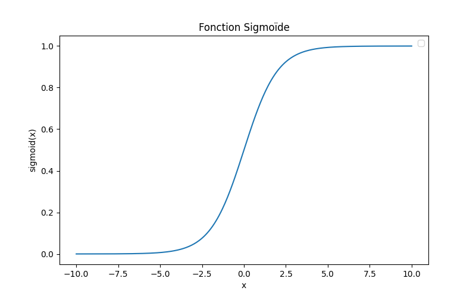

## GBoost : introduction

L'algorithme GBoost est une méthode d'apprentissage automatique utilisée pour améliorer la performance des modèles de prédiction, notamment les arbres de décision. Il appartient à la famille des algorithmes d’ensemble et repose sur l’idée d’entraîner plusieurs modèles de manière séquentielle afin de réduire progressivement l’erreur. Contrairement à une forêt aléatoire, qui entraîne des arbres en parallèle et agrège leurs résultats, GBoost ajuste chaque nouvel arbre en fonction des erreurs des arbres précédents pour corriger leurs prédictions.

Les arbres de décision seuls présentent plusieurs limites. Ils sont très sensibles aux données d’apprentissage et peuvent soit sous-ajuster, en ne capturant pas suffisamment les tendances, soit sur-ajuster, en s’adaptant trop aux spécificités des données et en perdant leur capacité de généralisation. De plus, leur performance est fortement influencée par la structure des données et par la qualité de l’étiquetage. Dans un contexte où l’on dispose d’un volume suffisant de données bien structurées et où l’objectif est d’atteindre une haute précision, GBoost permet d’améliorer un arbre de décision en l’intégrant dans un processus itératif de correction des erreurs.

## Principe de fonctionnement

GBoost construit une série d’arbres de décision de manière séquentielle, où chaque nouvel arbre est entraîné pour minimiser l’erreur des prédictions accumulées. L’idée centrale est que chaque nouvel arbre vient corriger les erreurs du modèle précédent en se basant sur la direction qui permet de réduire la fonction de perte.

### Données

L'algorithme prend en entrée des données $X$ et produit en sortie une prédiction $Y$. Il existe deux types de prédiction : une prédiction de classe (un nombre représentant une catégorie) ou une prédiction par régression (un nombre continu représentant une quantité). L'algorithme GBoost est implémenté pour les deux types avec les bibliothèques [`GradientBoostingClassifier`](https://scikit-learn.org/stable/modules/generated/sklearn.ensemble.GradientBoostingClassifier.html) ou [`GradientBoostingRegressor`](https://scikit-learn.org/stable/modules/generated/sklearn.ensemble.GradientBoostingRegressor.html).

Les données en entrée du modèle sont des caractéristiques (features) provenant d'un ensemble de données. Par exemple, pour la classification d’utilisateurs « polluants » ou « légitimes », on pourrait avoir : `nombre_de_tweets`, `similarité_tweets`, `fréquence_tweets`. La classe en sortie, dans ce cas, correspond à une classification : `0` pour un utilisateur légitime et `1` pour un utilisateur polluant. Par exemple, supposons cet ensemble de données :

| **nombre_de_tweets** | **similarité_tweets** | **fréquence_tweets** | **classe** |
| -------------------- | --------------------- | -------------------- | ---------- |
| 1087                 | 3.10                  | 2                    | 1          |
| 1200                 | 0.1                   | 1.25                 | 0          |
| 1000                 | 1.6                   | 0.05                 | 0          |
| 890                  | 1.5                   | 0.9                  | 1          |
| 500                  | 2.5                   | 1.2                  | 0          |
| 950                  | 1.0                   | 0.7                  | 1          |

> **Note** : La `similarité_tweets` est une cote z de la similarité des tweets d'un utilisateur comparée aux autres utilisateurs. Une cote z faible signifie que les tweets de cet utilisateur se ressemblent peu d'un tweet à l'autre. Une cote élevée signifie que l’utilisateur tweete des messages très semblables.

### Construction de l'arbre de décision

Dans la première passe de l’algorithme, on construit un premier arbre de décision.

Dans cet arbre, nous voyons qu’il y a une donnée mal classée. Dans un vrai scénario, le nombre de données mal classées serait beaucoup plus grand.

| **nombre_de_tweets** | **similarité_tweets** | **fréquence_tweets** | **classe** | **Prédiction** |
| -------------------- | --------------------- | -------------------- | ---------- | --------- |
| **1087**                 | **3.10**                  | **2**                    | **1**          | **0** |
| 1200                 | 0.1                   | 1.25                 | 0          | 0 |
| 1000                 | 1.6                   | 0.05                 | 0          | 0 |
| 890                  | 1.5                   | 0.9                  | 1          | 1 |
| 500                  | 2.5                   | 1.2                  | 0          | 0 |
| 950                  | 1.0                   | 0.7                  | 1          | 1 |

### Correction de l'erreur 

Il existe deux équations pour la calculer : l’une pour la régression et l’autre pour la classification.

>**NOTE**: Pour la régression, on utilise : $$r_{im} = - \left[ \frac{\partial L(y_i, F(x_i))}{\partial F(x_i)} \right]_{F(x) = F_{m-1}(x)} \quad \text{for } i = 1, \dots, n.$$ 
$n$ : Nombre total d’exemples dans le jeu de données.  
$m$ : L’arbre de décision.  
$i$ : L’exemple de donnée.  
$F(x_i)$ : La prédiction $F()$ de l'arbre pour les valeurs $x$ de la ligne $i$  
$y_i$ : La vraie classe de l'exemple $ i $ (0 ou 1). 
$\frac{\partial L(y_i, F(x_i))}{\partial F(x_i)} $ : La pente du gradient. Cette fonction peut varier selon le type de perte desiré. Sous sa forme la plus simple, on fait seulement la difference : `valeur_observée - valeur_réel`. $L(y_i, F(x_i)) : y_i - F(x_i)$ 
$- \left[ \partial L(y_i, F(x_i))\right]_{F(x) = F_{m-1}(x)} $ : Signifie qu'on calcule la perte residuelle pour l'ensemble de données.  
Cette perte est conçue pour des valeurs continues, mais comme l’exemple utilise une classification, nous ne pouvons pas l’utiliser dans ce cas.

Pour calculer l’erreur pour une classification, on utilise la fonction de perte log-loss suivante (la perte utilisée par défaut par sklearn) :

$$
\mathcal{L} = - \frac{1}{n} \sum_{i=1}^{n} \left[ y_i \log(\hat{y}_i) + (1 - y_i) \log(1 - \hat{y}_i) \right]
$$

Où : 
$ n $ : Nombre total d’exemples dans le jeu de données.  
$ y_i $ : La vraie classe de l'exemple $ i $ (0 ou 1). 
$ \hat{y}_i $ : La probabilité prédite pour que l'exemple $ i $ appartienne à la classe 1 (généralement sortie d'une fonction sigmoïde). 

Pour cet exemple, par souci de simplicité des calculs, on simplifie la perte en :
$$
r_{im} = y_i - \hat{p}_i
$$

Où : 
$ y_i $ : La vraie classe de l'exemple $ i $ (0 ou 1). 
$ \hat{p}_i $ : La probabilité prédite pour la classe 1.

>**NOTE**: Cette perte simplifiée est utile pour illustrer l’algorithme, mais en pratique, la **log-loss** pénalise plus sévèrement les erreurs et mène à une convergence plus rapide.

Pour calculer l’erreur résiduelle de la première ligne de notre ensemble de données, il faut connaître $\hat{p}_1$, dont la formule est :

$$
\hat{p}_i = \frac{\text{nombre d'observations de classe réel dans la feuille}}{\text{nombre total d'observations dans la feuille}}
$$

Selon la donnée et notre arbre de décision, on cherche à déterminer dans quelle feuille se trouve notre donnée mal classée :
| **nombre_de_tweets** | **similarité_tweets** | **fréquence_tweets** | **classe** | **Prédiction** |
| -------------------- | --------------------- | -------------------- | ---------- | --------- |
| **1087**                 | **3.10**                  | **2**                    | **1**          | **0** |

En partant du sommet :

- similarité_tweets <= 0.55 == Faux → gauche
- similarité_tweets <= 1.55 == Faux → gauche

On tombe dans la feuille : `sample = 3, value = [2,1], class = legitime`.
La value représente le nombre de données de la classe 0 (légitime) et 1 (pollueur). Dans ce cas-ci $[2,1]$ signifie qu'il y a deux exemples légitimes et un exemple pollueur classé dans cette feuille. Donc, il y a un utilisateur pollueur mal classé dans une feuille légitime.

$$
\hat{p}_1 = \frac{\text{nombre d'observations de classe réel dans la feuille}}{\text{nombre total d'observations dans la feuille}}
$$

$$
\hat{p}_1 = \frac{1}{3} = 0.33333
$$

Pour calculer l'erreur pour la première ligne ($i$) du premier arbre ($m$), on fait :  

$$
r_{1,1} = y_1 - \hat{p}_1 = 1 - 0.33333 = 0.66667
$$

Cette valeur de perte est appelée **pseudo-erreur résiduelle**, car il s’agit d’une pseudo-erreur et non pas d’une dérivée.    

Ensuite, on effectue cette opération pour toutes les lignes de l’ensemble de données, ce qui donne par exemple :

| **nombre_de_tweets** | **similarité_tweets** | **fréquence_tweets** | **classe** | **Prédiction** | **pseudo-erreur résiduelles** |
| -------------------- | --------------------- | -------------------- | ---------- | --------- |  --------- |
| **1087**                 | **3.10**                  | **2**                    | **1**          | **0** |  **0.666667** |
| 1200                 | 0.1                   | 1.25                 | 0          | 0 | 0 |
| 1000                 | 1.6                   | 0.05                 | 0          | 0 | -0.333333 |
| 890                  | 1.5                   | 0.9                  | 1          | 1 | 0 |
| 500                  | 2.5                   | 1.2                  | 0          | 0 | -0.333333 |
| 950                  | 1.0                   | 0.7                  | 1          | 1 | 0 |
[Code](erreurs_residuelles.py) 

### Deuxième arbre 

Une fois que l’erreur a été calculée pour le premier arbre, la prochaine étape dans l’algorithme GBoost consiste à construire un nouvel arbre dont le but n’est pas de prédire la classe comme le premier arbre, mais plutôt de prédire la **pseudo-erreur résiduelle** du premier arbre.

>**NOTE** :  L’entraînement d’arbres consécutifs est aussi appelé **weak learner**, et l’addition de ces arbres pour classifier une donnée est appelée **strong learner**. Le terme **pseudo** provient du fait qu’on n’utilise pas la formule de calcul de la pente du gradient (première dérivée).

Le principe est de refaire les étapes de construction de l’arbre de décision avec les mêmes $X$ en entrée, mais en utilisant les erreurs résiduelles comme $Y$.

### Mise à jour du modèle 

Une fois que le deuxième *weak learner* est entraîné, on applique une formule pour que chaque arbre de décision soit pris en compte dans le but de créer un ensemble de *weak learners* qui contribuent à la classification finale. Le principe est de diminuer l’erreur résiduelle à chaque arbre afin de converger vers une solution. On applique un poids à chacun des arbres de décision. Ce poids, aussi appelé taux d’apprentissage (learning rate), permet de converger lentement vers une solution. Un taux d’apprentissage trop élevé peut causer un surajustement au bruit dans les données.

L’ensemble du modèle est alors mis à jour en ajoutant une version pondérée du nouvel arbre à la prédiction précédente :
$$
F_m(x) = F_{m-1}(x) + \nu \cdot h_m(x)
$$
où $h_m(x)$ est la prédiction du nouvel arbre et $\nu$ est le taux d’apprentissage (learning rate) qui contrôle la contribution de chaque nouvel arbre.

Par exemple, si on prend un cas hypothétique où l’on définit $\nu=0.1$ et que l’on a 100 arbres de décision qui prédisent tous la classe 1 :

$$
  F_{99}(x) = 0.1 \times 100 = 10.
$$

Pour connaître la prédiction finale de l’ensemble des arbres, on applique une fonction sigmoïde :
$$
p(x) = \frac{1}{1 + \exp(-10)} \approx 0.99995.
$$

Enfin, on applique un seuil à 0.5 pour déterminer la classe. Dans ce cas-ci, $p(x) \approx 0.99995 \geq 0.5$, donc la classe prédite est `1`. Cela fait beaucoup de sens puisque les 100 arbres ont prédit la classe `1`.

La fonction sigmoïde a pour but de normaliser en pourcentage et de séparer les données de manière non linéaire :
 

### Condition d'arrêt

Il existe plusieurs types de conditions d’arrêt.

**Nombre d’itérations** : La plus simple consiste à fixer un nombre d’itérations. Plus on ajoute d’arbres de décision, plus l’algorithme prendra du temps à s’exécuter. Dans un cas où l’on dispose de ressources limitées pour la classification, on peut choisir un nombre maximal d’arbres, même si l’on n’a pas nécessairement atteint la meilleure performance.

**Amélioration de la perte** : Au-delà d’un certain point, les gains obtenus en créant de nouveaux arbres de décision sont minimes. Le ratio temps d’exécution / gain en performance ne justifie plus de continuer.

**Meilleur perfomance** : On peut également attendre que la performance atteigne son maximum.

Les conditions d'arrête et autre hyper-parametre tel que le taux d'apprentissage, la profondeur des arbres, le nombre d'arbre, etc. peuvent etre recherche en faisant une validation croisé. La validation permet de tester différent hyper-parametre sur different partie des données. 

### GBoost résumé  

En somme, on construit plusieurs arbres de décision qui contribuent chacun à une fraction de la décision finale. Les arbres qui suivent le premier prédisent la pseudo-erreur résiduelle et tentent de la corriger avec un certain taux, réduisant ainsi progressivement l’erreur de l’arbre précédent. Ce processus itératif assure une convergence vers un minimum.    

## Forces et avantages

L’algorithme GBoost offre plusieurs avantages. Tout d’abord, il permet d’obtenir des performances élevées en ajustant finement les erreurs du modèle à chaque itération, ce qui améliore la précision par rapport à un simple arbre de décision ou à une forêt aléatoire. Ensuite, il est flexible, car il peut être appliqué à divers types de problèmes en ajustant la fonction de perte et les hyperparamètres, tels que la profondeur des arbres, le taux d’apprentissage et le nombre d’arbres.

Toutefois, cette approche présente des inconvénients. L’entraînement des arbres étant séquentiel, GBoost est plus lent que des méthodes parallélisables comme la forêt aléatoire. L’apprentissage dépend des itérations précédentes, ce qui limite la performance comparée à d’autres algorithmes.

GBoost peut également être sujet au surajustement si le nombre d’arbres est trop élevé ou si le modèle apprend trop fidèlement les données d’entraînement. Pour éviter cela, il est recommandé d’utiliser un taux d’apprentissage faible, associé à un nombre plus important d’arbres, ce qui permet une correction plus progressive des erreurs et une meilleure généralisation au coût d’un plus grand nombre d’itérations (donc plus de temps et de ressources pour classer une nouvelle donnée).

Les résultats de l’algorithme sont sensibles aux hyperparamètres. Le nombre d’itérations, le taux d’apprentissage et la taille des arbres sont autant de paramètres qui donneront des performances plus ou moins bonnes selon le type de données en entrée. Il peut être difficile de trouver une solution optimale dans l’espace d’hyperparamètres.

Des variantes comme XGBoost introduisent des techniques de régularisation supplémentaires pour améliorer la robustesse et la rapidité d’entraînement.

## Conclusion

En comparaison avec d’autres méthodes d’ensemble, GBoost est particulièrement efficace lorsque les données d’entrée sont bien structurées et que la précision est un critère important. Son interprétabilité est également un avantage, car il est possible d’examiner l’importance des différentes variables et la contribution de chaque arbre aux prédictions finales. GBoost est un algorithme qui améliore la précision des modèles prédictifs en corrigeant itérativement les erreurs des arbres de décision, autant pour la classification que pour la régression, mais il nécessite un réglage minutieux pour éviter le surajustement et pour limiter le temps d’entraînement.

# Références

[Gradient Boosting Algorithm: A Complete Guide for Beginners](https://www.analyticsvidhya.com/blog/2021/09/gradient-boosting-algorithm-a-complete-guide-for-beginners/)

[GradientBoostingClassifier](https://scikit-learn.org/stable/modules/generated/sklearn.ensemble.GradientBoostingClassifier.html)

[GradientBoostingRegressor](https://scikit-learn.org/stable/modules/generated/sklearn.ensemble.GradientBoostingRegressor.html)

[Wikipedia - Gradient boosting](https://en.wikipedia.org/wiki/Gradient_boosting)

